# DIAGRAMME — ESL Système de Gestion Universitaire
# École de Santé de Libreville — v1.0.0

> Ce fichier contient la description complète du projet et tous ses diagrammes techniques.
> All diagrams use [Mermaid](https://mermaid.js.org/) syntax and ASCII art.

---

## Table des Matières

1. [Vue d'ensemble du système](#1-vue-densemble-du-système)
2. [Diagramme d'Architecture (C4)](#2-diagramme-darchitecture-c4)
3. [Diagramme de Cas d'Utilisation](#3-diagramme-de-cas-dutilisation)
4. [Diagramme de Séquence — Connexion](#4-diagramme-de-séquence--connexion)
5. [Diagramme de Séquence — Calcul des Notes](#5-diagramme-de-séquence--calcul-des-notes)
6. [Diagramme de Séquence — Paiement](#6-diagramme-de-séquence--paiement)
7. [Diagramme de Séquence — E-Learning Quiz](#7-diagramme-de-séquence--e-learning-quiz)
8. [Diagramme de Classes (Modèles)](#8-diagramme-de-classes-modèles)
9. [Diagramme Entité-Relation (ERD)](#9-diagramme-entité-relation-erd)
10. [Diagramme de Flux de Données (DFD)](#10-diagramme-de-flux-de-données-dfd)
11. [Diagramme d'États — Inscription](#11-diagramme-détats--inscription)
12. [Diagramme d'États — Notes](#12-diagramme-détats--notes)
13. [Diagramme d'États — Paiement](#13-diagramme-détats--paiement)
14. [Diagramme de Composants Frontend](#14-diagramme-de-composants-frontend)
15. [Diagramme de Déploiement](#15-diagramme-de-déploiement)
16. [Diagramme d'Activité — Workflow Enseignant](#16-diagramme-dactivité--workflow-enseignant)
17. [Diagramme d'Activité — Workflow Étudiant](#17-diagramme-dactivité--workflow-étudiant)
18. [Diagramme de Navigation (Routes)](#18-diagramme-de-navigation-routes)
19. [Formule de Calcul des Notes](#19-formule-de-calcul-des-notes)
20. [Matrice des Permissions par Rôle](#20-matrice-des-permissions-par-rôle)

---

## 1. Vue d'ensemble du système

```
┌─────────────────────────────────────────────────────────────────────────────┐
│                    ESL — SYSTÈME DE GESTION UNIVERSITAIRE                   │
│                        École de Santé de Libreville                         │
├──────────────────┬──────────────────────┬───────────────────────────────────┤
│    FRONTEND      │       BACKEND        │          BASE DE DONNÉES          │
│   (React 18)     │    (Laravel 10)      │           (MySQL 8)               │
│   Port: 5173     │    Port: 8000        │          Port: 3306               │
├──────────────────┼──────────────────────┼───────────────────────────────────┤
│ • React Router   │ • REST API           │ • 30+ tables                      │
│ • Vite + HMR     │ • Sanctum Auth       │ • Foreign Keys                    │
│ • Tailwind CSS   │ • Eloquent ORM       │ • Migrations & Seeders            │
│ • Framer Motion  │ • Role Middleware    │ • Indexes optimisés               │
│ • Axios          │ • File Storage       │                                   │
│ • Chart.js       │ • CORS Config        │                                   │
│ • i18n (FR/EN)   │ • PHP 8.1+           │                                   │
└──────────────────┴──────────────────────┴───────────────────────────────────┘

5 RÔLES UTILISATEURS:
  👤 Admin       → Gestion globale du système
  📋 Registrar   → Gestion des inscriptions/étudiants
  💰 Finance     → Gestion des frais et paiements
  🎓 Teacher     → Cours, notes, présences
  📚 Student     → Consultation, e-learning, paiement
```

---

## 2. Diagramme d'Architecture (C4)

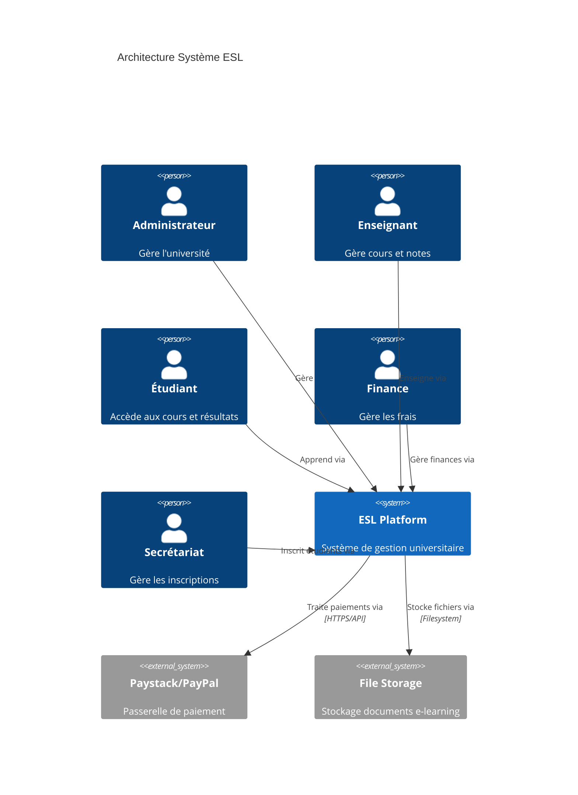

**Architecture en couches :**

```
┌──────────────────────────────────────────────────────────────┐
│                        PRÉSENTATION                          │
│   React.js • Tailwind CSS • Framer Motion • i18n FR/EN       │
├──────────────────────────────────────────────────────────────┤
│                          API REST                            │
│   Axios • Authorization Bearer Token • JSON Responses        │
├──────────────────────────────────────────────────────────────┤
│                       AUTHENTIFICATION                       │
│   Laravel Sanctum • Token Management • Role Middleware       │
├──────────────────────────────────────────────────────────────┤
│                      LOGIQUE MÉTIER                          │
│   Controllers • Services • Eloquent Models • Policies        │
├──────────────────────────────────────────────────────────────┤
│                    ACCÈS AUX DONNÉES                         │
│   Eloquent ORM • Query Builder • Migrations • Seeders        │
├──────────────────────────────────────────────────────────────┤
│                      BASE DE DONNÉES                         │
│             MySQL 8 • 30+ Tables • Foreign Keys              │
└──────────────────────────────────────────────────────────────┘
```

---

## 3. Diagramme de Cas d'Utilisation

```mermaid
graph TB
    subgraph Système ESL
        UC1[Connexion]
        UC2[Voir Dashboard]
        UC3[Gérer Étudiants]
        UC4[Gérer Enseignants]
        UC5[Gérer Cours/Classes]
        UC6[Saisir Notes]
        UC7[Marquer Présences]
        UC8[E-Learning]
        UC9[Gestion Financière]
        UC10[Générer Rapports]
        UC11[Paramètres]
        UC12[Chatbot Simon]
        UC13[Payer Frais]
        UC14[Consulter Notes]
        UC15[Valider/Refuser Notes]
        UC16[Gérer Inscriptions]
    end

    Admin([👤 Admin]) --> UC1
    Admin --> UC2
    Admin --> UC3
    Admin --> UC4
    Admin --> UC5
    Admin --> UC10
    Admin --> UC11
    Admin --> UC12
    Admin --> UC15

    Registrar([📋 Registrar]) --> UC1
    Registrar --> UC3
    Registrar --> UC4
    Registrar --> UC16
    Registrar --> UC12

    Finance([💰 Finance]) --> UC1
    Finance --> UC9
    Finance --> UC10
    Finance --> UC12

    Teacher([🎓 Teacher]) --> UC1
    Teacher --> UC2
    Teacher --> UC6
    Teacher --> UC7
    Teacher --> UC8
    Teacher --> UC11
    Teacher --> UC12

    Student([📚 Student]) --> UC1
    Student --> UC2
    Student --> UC14
    Student --> UC8
    Student --> UC13
    Student --> UC11
    Student --> UC12
```

---

## 4. Diagramme de Séquence — Connexion

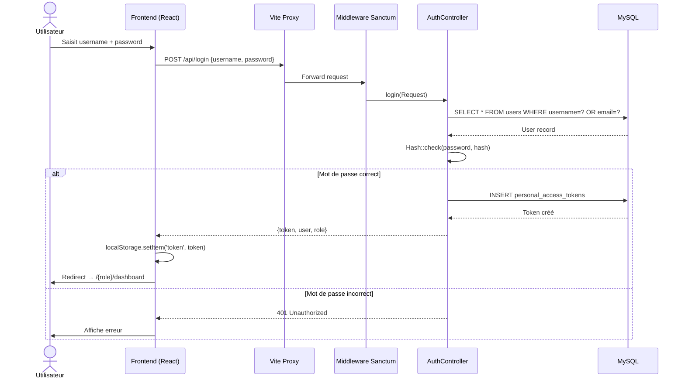

---

## 5. Diagramme de Séquence — Calcul des Notes

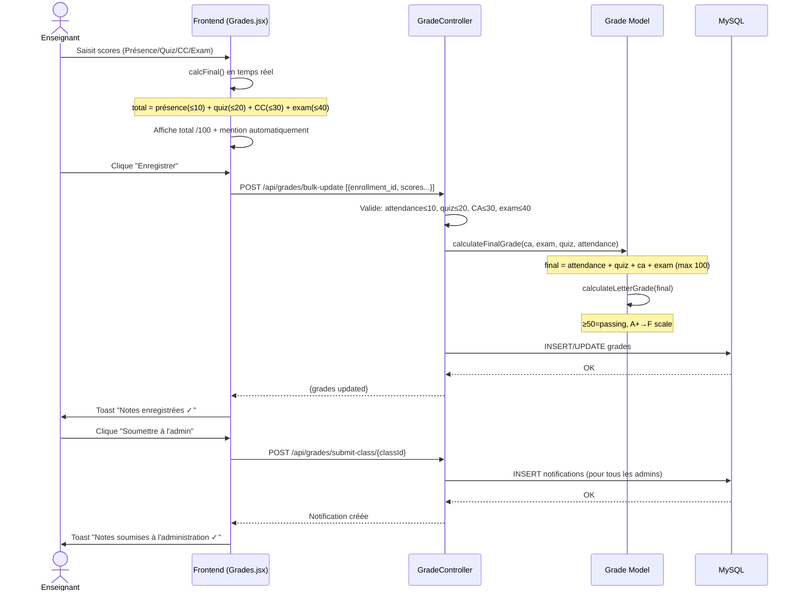

### Formule détaillée :

```
┌─────────────────────────────────────────────────────┐
│              CALCUL DE LA NOTE FINALE                │
├──────────────────────┬──────────────┬───────────────┤
│ Composante           │ Maximum      │ Pourcentage   │
├──────────────────────┼──────────────┼───────────────┤
│ Présence (Attendance)│     /10      │     10%       │
│ Quiz                 │     /20      │     20%       │
│ Contrôle Continu (CC)│     /30      │     30%       │
│ Examen Final         │     /40      │     40%       │
├──────────────────────┼──────────────┼───────────────┤
│ TOTAL                │    /100      │    100%       │
└──────────────────────┴──────────────┴───────────────┘

Note Finale = Présence + Quiz + CC + Examen  (simple addition)
Seuil de passage : 50/100

Mentions:
  A+ : ≥ 90  |  A : ≥ 85  |  A- : ≥ 80
  B+ : ≥ 75  |  B : ≥ 70  |  B- : ≥ 65
  C+ : ≥ 60  |  C : ≥ 55  |  C- : ≥ 50
  D+ : ≥ 45  |  D : ≥ 40  |  F  : < 40
```

---

## 6. Diagramme de Séquence — Paiement

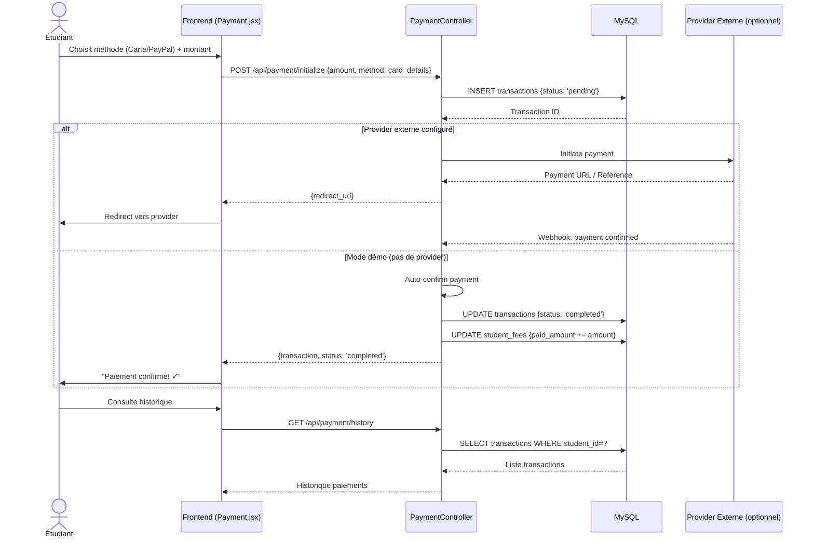

---

## 7. Diagramme de Séquence — E-Learning Quiz

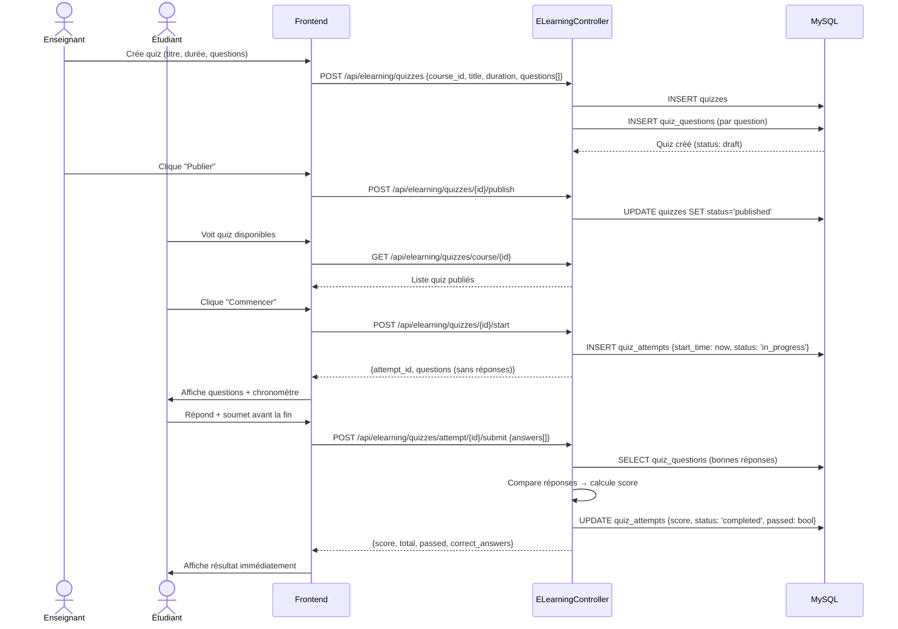

---

## 8. Diagramme de Classes (Modèles)

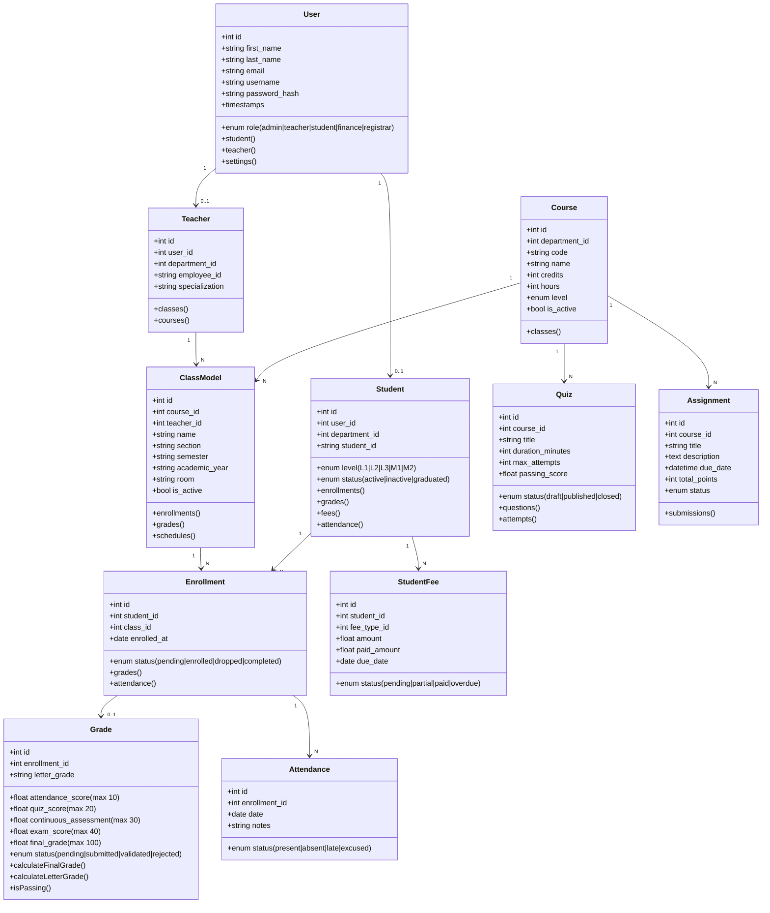

---

## 9. Diagramme Entité-Relation (ERD)

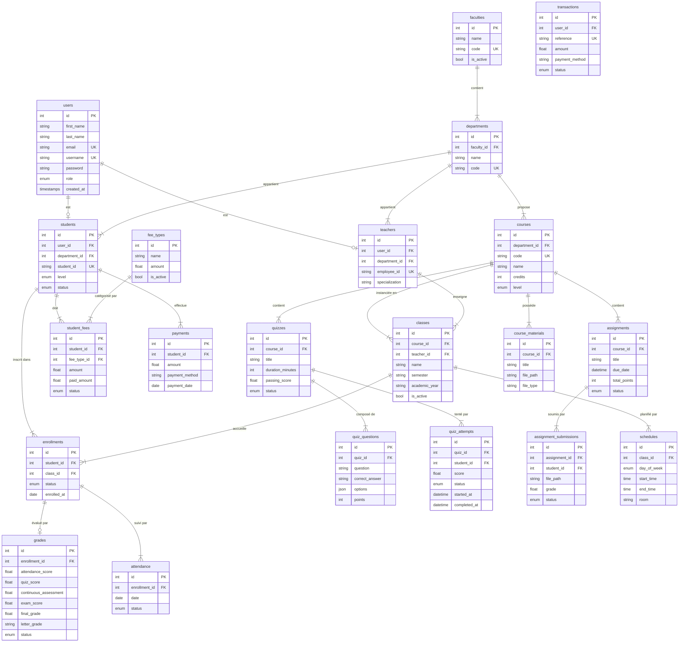

---

## 10. Diagramme de Flux de Données (DFD)

```
NIVEAU 0 — Vue globale:

  ┌─────────────┐    Requête HTTP    ┌──────────────────────────────┐
  │ Utilisateur │ ─────────────────► │                              │
  │  (Browser)  │                    │     Système ESL              │
  │             │ ◄───────────────── │     (Laravel + React)        │
  └─────────────┘    Réponse HTML/   └──────────────────────────────┘
                     JSON


NIVEAU 1 — Décomposition:

  ┌───────────────┐                  ┌──────────────────────────────┐
  │   Navigateur  │ ──POST /login──► │ P1: Authentification         │
  │   React SPA   │ ◄──Token JSON─── │    (AuthController)          │
  └───────────────┘                  └───────────┬──────────────────┘
          │                                      │ Vérifie/Stocke Token
          │ API calls + Bearer Token             ▼
          │                          ┌──────────────────────────────┐
          │                          │ P2: Routage par Rôle         │
          │                          │    (RoleMiddleware)          │
          │                          └───────────┬──────────────────┘
          │                                      │
          │                    ┌─────────────────┼──────────────────┐
          │                    ▼                 ▼                  ▼
          │         ┌──────────────┐  ┌──────────────┐  ┌──────────────────┐
          │         │ P3: Admin    │  │ P4: Teacher  │  │ P5: Student/     │
          │         │    Module    │  │    Module    │  │    Finance/Reg   │
          │         └──────┬───────┘  └──────┬───────┘  └──────────┬───────┘
          │                │                 │                      │
          │                └─────────────────┼──────────────────────┘
          │                                  │
          │                                  ▼
          │                    ┌──────────────────────────────┐
          │                    │       P6: Base de Données    │
          │                    │         (MySQL / Eloquent)   │
          │                    └──────────────────────────────┘
          │                                  │
          └──────────────────────────────────┘
                     Données JSON retournées


NIVEAU 2 — Flux des Notes:

  Enseignant ──saisie notes──► GradeController
                                    │
                    ┌───────────────┼────────────────────┐
                    ▼               ▼                    ▼
              Valide scores   calculateFinal()    calculateLetter()
              (max 10/20/30/40) (sum all parts)   (A+→F scale)
                    │               │                    │
                    └───────────────┼────────────────────┘
                                    ▼
                              grades (table)
                                    │
                                    ▼
                         Notification → Admin
                                    │
                         Admin valide ou refuse
                                    │
                                    ▼
                       Étudiant voit ses notes
```

---

## 11. Diagramme d'États — Inscription

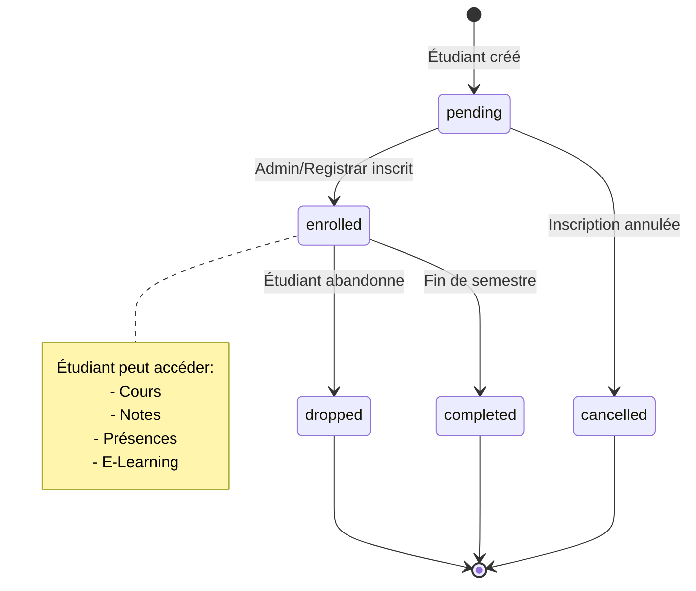

---

## 12. Diagramme d'États — Notes

```mermaid
stateDiagram-v2
    [*] --> not_submitted : Classe créée

    not_submitted --> pending : Enseignant saisit des notes

    pending --> submitted : Enseignant soumet à l'admin
    Note over submitted : Admin notifié

    submitted --> validated : Admin valide ✓
    submitted --> rejected : Admin refuse ✗

    rejected --> pending : Enseignant corrige

    validated --> [*]
    Note over validated : Visible pour l'étudiant
```

---

## 13. Diagramme d'États — Paiement

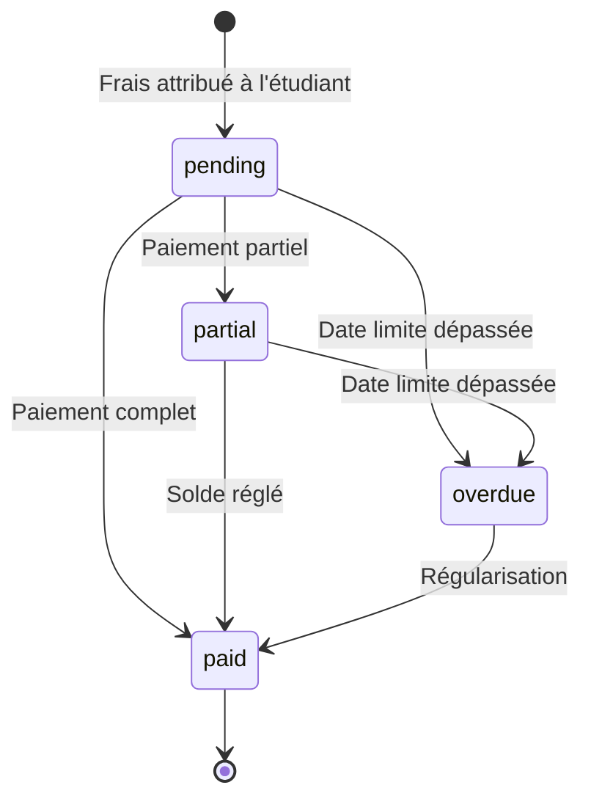

---

## 14. Diagramme de Composants Frontend

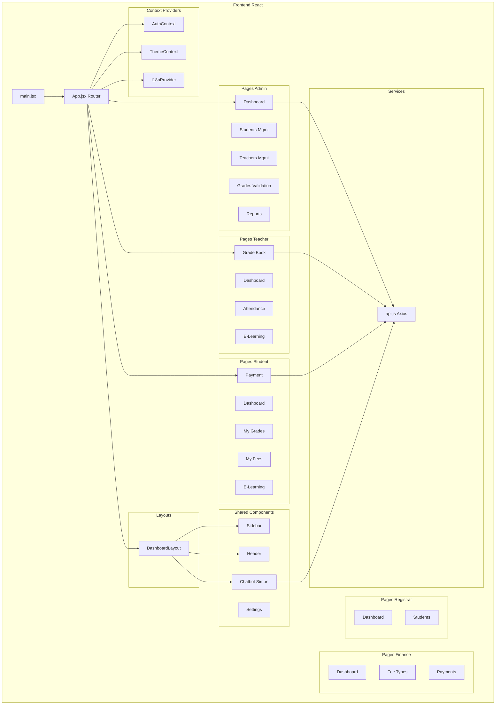

---

## 15. Diagramme de Déploiement

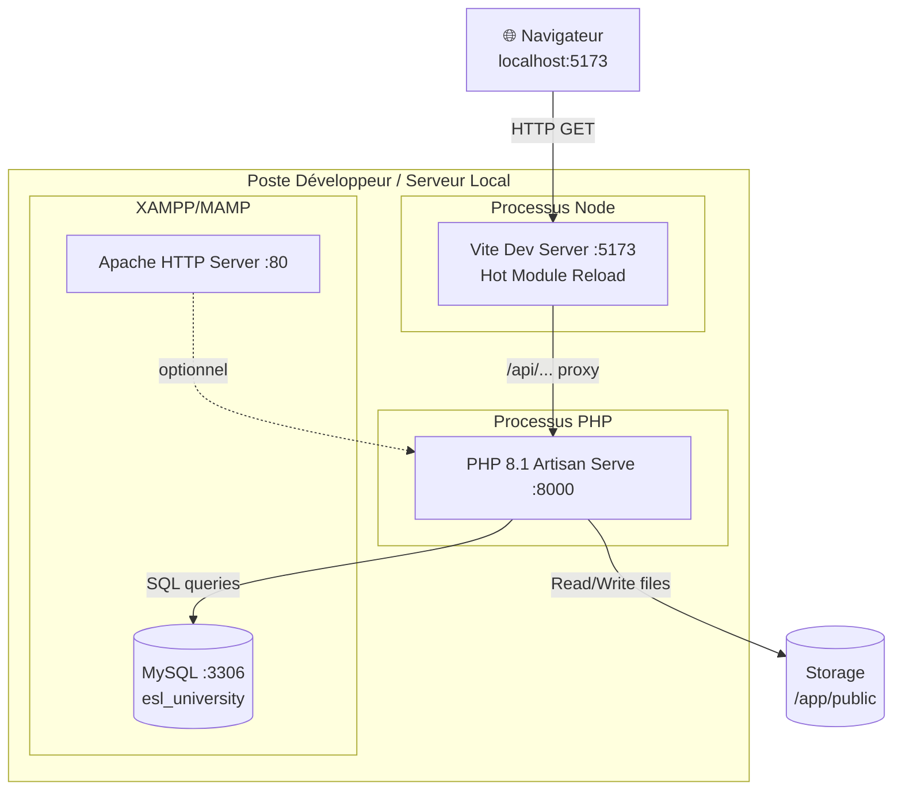

**Déploiement Production (recommandé) :**

```
Internet
    │
    ▼
┌──────────────┐
│   Nginx/Apache│  Reverse proxy + SSL (HTTPS)
│   Port 443   │
└──────┬───────┘
       │                    ┌─────────────────────┐
       ├──── /api/*  ──────►│  PHP-FPM 8.1        │
       │                    │  Laravel Backend     │
       │                    └──────────┬──────────┘
       │                               │
       │                    ┌──────────▼──────────┐
       ├──── /* ────────────►│  React Build (dist/)│
       │                    │  Static Files        │
       │                    └─────────────────────┘
       │                               │
       │                    ┌──────────▼──────────┐
       └────────────────────►│  MySQL 8            │
                             │  esl_university      │
                             └─────────────────────┘
```

---

## 16. Diagramme d'Activité — Workflow Enseignant

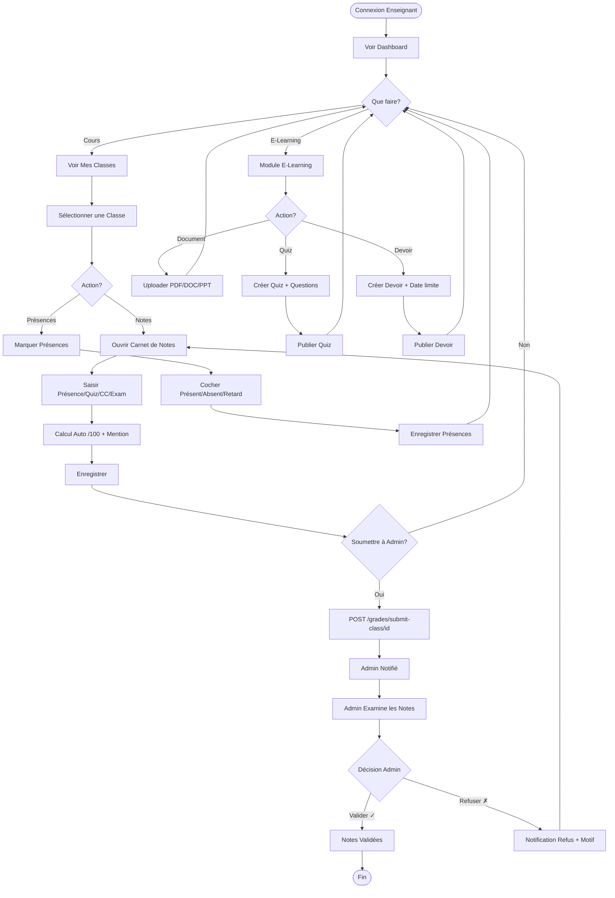

---

## 17. Diagramme d'Activité — Workflow Étudiant

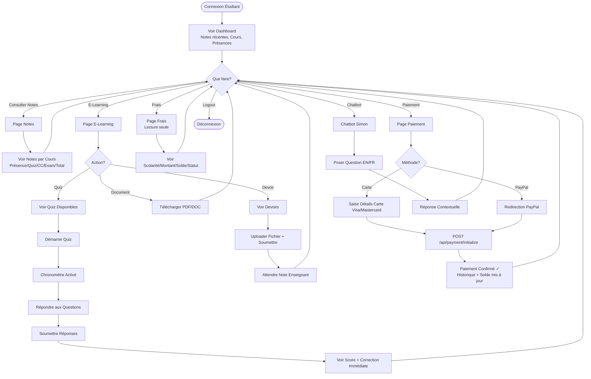

---

## 18. Diagramme de Navigation (Routes)

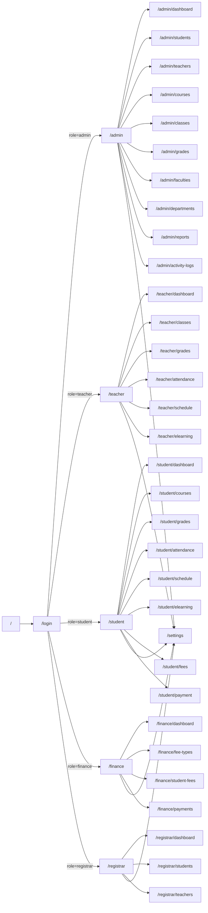

---

## 19. Formule de Calcul des Notes

```
╔══════════════════════════════════════════════════════════════════════╗
║              SYSTÈME DE NOTATION ESL — DÉTAIL COMPLET               ║
╠══════════════════════════════════════════════════════════════════════╣
║                                                                      ║
║  Composante           │ Points max │  Signification                  ║
║  ─────────────────────┼────────────┼─────────────────────────────── ║
║  Présence / Attendance│    10 pts  │  Assiduité au cours             ║
║  Quiz                 │    20 pts  │  Tests courts en cours          ║
║  Contrôle Continu (CC)│    30 pts  │  Évaluations continues (CAT)    ║
║  Examen Final         │    40 pts  │  Examen de fin de semestre      ║
║  ─────────────────────┼────────────┼─────────────────────────────── ║
║  TOTAL                │   100 pts  │  Note finale sur 100            ║
║                                                                      ║
║  Formule PHP (Grade Model):                                          ║
║   final = $attendance + $quiz + $ca + $exam                         ║
║                                                                      ║
║  Formule JavaScript (teacher/Grades.jsx):                           ║
║   calcFinal = (a + quiz + ca + exam)                                ║
║   (calcul en temps réel pendant la saisie)                          ║
║                                                                      ║
║  Seuil de passage : 50 / 100                                        ║
║                                                                      ║
║  Mentions:                                                           ║
║   A+ : 90-100  │  A  : 85-89  │  A- : 80-84                        ║
║   B+ : 75-79   │  B  : 70-74  │  B- : 65-69                        ║
║   C+ : 60-64   │  C  : 55-59  │  C- : 50-54                        ║
║   D+ : 45-49   │  D  : 40-44  │  F  : < 40                         ║
╚══════════════════════════════════════════════════════════════════════╝
```

---

## 20. Matrice des Permissions par Rôle

```
╔═══════════════════════════════════════════════════════════════════════════════════╗
║                         MATRICE DES PERMISSIONS                                   ║
╠═════════════════════════════╦═══════╦══════════╦═════════╦═════════╦═════════════╣
║ Fonctionnalité              ║ Admin ║ Registrar║ Finance ║ Teacher ║   Student   ║
╠═════════════════════════════╬═══════╬══════════╬═════════╬═════════╬═════════════╣
║ Dashboard dédié             ║   ✅   ║    ✅     ║    ✅    ║    ✅    ║      ✅      ║
║ Gestion Facultés/Depts      ║   ✅   ║    ❌     ║    ❌    ║    ❌    ║      ❌      ║
║ Gestion Cours               ║   ✅   ║    ❌     ║    ❌    ║    ❌    ║      ❌      ║
║ Gestion Classes             ║   ✅   ║    ❌     ║    ❌    ║    ❌    ║      ❌      ║
║ Créer Étudiants             ║   ✅   ║    ✅     ║    ❌    ║    ❌    ║      ❌      ║
║ Créer Enseignants           ║   ✅   ║    ✅     ║    ❌    ║    ❌    ║      ❌      ║
║ Inscrire Étudiants          ║   ✅   ║    ✅     ║    ❌    ║    ❌    ║      ❌      ║
║ Saisir Notes                ║ VIEW  ║    ❌     ║    ❌    ║    ✅    ║    VIEW     ║
║ Valider/Refuser Notes       ║   ✅   ║    ❌     ║    ❌    ║    ❌    ║      ❌      ║
║ Marquer Présences           ║   ❌   ║    ❌     ║    ❌    ║    ✅    ║      ❌      ║
║ Voir ses Présences          ║   ❌   ║    ❌     ║    ❌    ║    ❌    ║      ✅      ║
║ Créer Types de Frais        ║   ❌   ║    ❌     ║    ✅    ║    ❌    ║      ❌      ║
║ Attribuer Frais Étudiants   ║   ❌   ║    ❌     ║    ✅    ║    ❌    ║      ❌      ║
║ Enregistrer Paiements       ║   ❌   ║    ❌     ║    ✅    ║    ❌    ║      ❌      ║
║ Payer en ligne              ║   ❌   ║    ❌     ║    ❌    ║    ❌    ║      ✅      ║
║ Voir ses Frais              ║   ❌   ║    ❌     ║    ❌    ║    ❌    ║   VIEW      ║
║ E-Learning Créer Contenu    ║   ❌   ║    ❌     ║    ❌    ║    ✅    ║      ❌      ║
║ E-Learning Accéder Contenu  ║   ❌   ║    ❌     ║    ❌    ║    ❌    ║      ✅      ║
║ Créer Quiz                  ║   ❌   ║    ❌     ║    ❌    ║    ✅    ║      ❌      ║
║ Passer Quiz                 ║   ❌   ║    ❌     ║    ❌    ║    ❌    ║      ✅      ║
║ Créer Devoir                ║   ❌   ║    ❌     ║    ❌    ║    ✅    ║      ❌      ║
║ Soumettre Devoir            ║   ❌   ║    ❌     ║    ❌    ║    ❌    ║      ✅      ║
║ Voir Journal Activité       ║   ✅   ║    ❌     ║    ❌    ║    ❌    ║      ❌      ║
║ Rapports Statistiques       ║   ✅   ║    ❌     ║    ✅    ║    ❌    ║      ❌      ║
║ Emploi du Temps             ║   ✅   ║    ❌     ║    ❌    ║    ✅    ║      ✅      ║
║ Paramètres Interface        ║   ✅   ║    ✅     ║    ✅    ║    ✅    ║      ✅      ║
║ Chatbot Simon (FR/EN)       ║   ✅   ║    ✅     ║    ✅    ║    ✅    ║      ✅      ║
╚═════════════════════════════╩═══════╩══════════╩═════════╩═════════╩═════════════╝

✅ = Accès complet  │  VIEW = Lecture seule  │  ❌ = Pas d'accès
```

---

## Chatbot Simon — Questions par Rôle

```
╔══════════════════════════════════════════════════════════════════════════╗
║                CHATBOT SIMON — QUESTIONS EXEMPLES PAR RÔLE              ║
╠══════════════════════════════╦═══════════════════════════════════════════╣
║         ADMINISTRATEUR        ║              QUESTIONS / ACTIONS         ║
╠══════════════════════════════╬═══════════════════════════════════════════╣
║ FR: Recherche étudiant Dupont ║ → Fiche complète: notes, présences, frais║
║ EN: Search for student Smith  ║                                           ║
║ FR: Statistiques globales     ║ → Total étudiants, enseignants, cours     ║
║ FR: KPIs institutionnels      ║ → Taux réussite, revenus, présence moy.  ║
║ FR: Alertes étudiants         ║ → Impayés + étudiants en dessous de 50   ║
║ FR: Notes soumises            ║ → Liste classes soumises par enseignants  ║
╠══════════════════════════════╬═══════════════════════════════════════════╣
║         SECRÉTARIAT           ║                                           ║
╠══════════════════════════════╬═══════════════════════════════════════════╣
║ FR: Inscriptions en attente   ║ → Nombre d'inscriptions à traiter         ║
║ FR: Combien d'étudiants actifs║ → Total / actifs / inscrits ce mois       ║
║ FR: Statistiques d'inscriptions║ → Vue d'ensemble enrollements            ║
║ FR: Nouveaux inscrits ce mois ║ → Liste nouveaux étudiants                ║
║ FR: Recherche étudiant Dupont ║ → Fiche étudiant                          ║
╠══════════════════════════════╬═══════════════════════════════════════════╣
║           FINANCE             ║                                           ║
╠══════════════════════════════╬═══════════════════════════════════════════╣
║ FR: Paiements en retard       ║ → Nombre impayés + montant total dû       ║
║ EN: Overdue payments          ║                                           ║
║ FR: Statistiques du jour      ║ → Paiements aujourd'hui + total global    ║
║ FR: Rapport mensuel           ║ → Paiements + montant + frais en attente  ║
║ FR: Résumé financier global   ║ → Frais attribués / encaissés / en retard ║
╠══════════════════════════════╬═══════════════════════════════════════════╣
║          ENSEIGNANT           ║                                           ║
╠══════════════════════════════╬═══════════════════════════════════════════╣
║ FR: Montre-moi mes cours      ║ → Liste classes assignées                 ║
║ EN: Show me my courses        ║                                           ║
║ FR: Combien d'étudiants j'ai  ║ → Nombre étudiants inscrits               ║
║ FR: Quel est mon emploi du    ║ → Horaires par jour                       ║
║     temps?                    ║                                           ║
║ FR: Comment saisir les notes? ║ → Guide étape par étape                   ║
║ EN: How to enter grades?      ║ → Présence/Quiz/CC/Exam → /100 auto       ║
╠══════════════════════════════╬═══════════════════════════════════════════╣
║           ÉTUDIANT            ║                                           ║
╠══════════════════════════════╬═══════════════════════════════════════════╣
║ FR: Quelles sont mes notes?   ║ → Notes par cours + moyenne générale       ║
║ EN: What are my grades?       ║                                           ║
║ FR: Combien dois-je payer?    ║ → Total / payé / reste à payer            ║
║ EN: How much are my fees?     ║                                           ║
║ FR: Mon emploi du temps       ║ → Horaires de cours inscrits              ║
║ FR: Mes cours inscrits        ║ → Liste des cours de l'étudiant           ║
║ FR: Mon taux de présence      ║ → % de présence                           ║
╚══════════════════════════════╩═══════════════════════════════════════════╝

🌐 LANGUE: FR/EN sélectionnable via le bouton 🇫🇷/🇬🇧 dans l'en-tête du chatbot
🎙️ VOIX: Reconnaissance vocale disponible (fr-FR ou en-US selon la langue active)
```

---

## Résumé Technique

```
┌─────────────────────────────────────────────────────────────────────────┐
│                      RÉSUMÉ TECHNIQUE DU PROJET                         │
├─────────────────┬───────────────────────────────────────────────────────┤
│ Frontend        │ React 18 + Vite 5 + Tailwind CSS 3 + Framer Motion   │
│ Backend         │ Laravel 10 + PHP 8.1 + Laravel Sanctum                │
│ Base de données │ MySQL 8 / MariaDB 10 — 30+ tables                     │
│ Authentification│ Token Sanctum + Middleware de rôle                    │
│ Internationalisa│ i18n FR/EN (frontend) + language param (chatbot API)  │
│ Stockage        │ Laravel Storage + Symlinks publics                    │
│ Paiement        │ Paystack / PayPal / Auto-confirm (démo)               │
│ Temps réel      │ Vote recognition (WebSpeech API)                      │
│ Rôles           │ admin / registrar / finance / teacher / student       │
│ Calcul Notes    │ Présence(/10) + Quiz(/20) + CC(/30) + Exam(/40) = 100 │
│ E-Learning      │ Cours en ligne, Documents, Quiz, Devoirs              │
│ Chatbot         │ Simon IA: contextuel par rôle, bilingue FR/EN         │
│ Build tool      │ Composer (PHP) + NPM (JS)                             │
│ Tests           │ PHPUnit (backend) + ESLint (frontend)                 │
└─────────────────┴───────────────────────────────────────────────────────┘

Démarrage rapide:
  cd backend  && php artisan migrate:fresh --seed && php artisan serve
  cd frontend && npm install && npm run dev
  → http://localhost:5173  (admin / admin123)
```

---

*© 2026 ESL — École de Santé de Libreville — Tous droits réservés*
